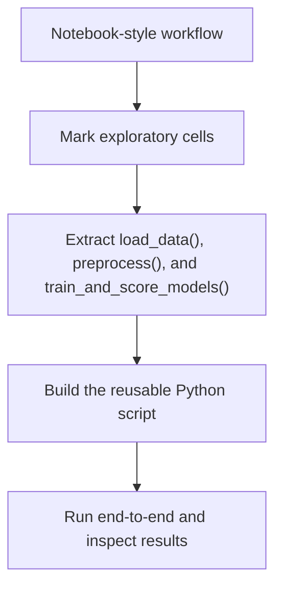
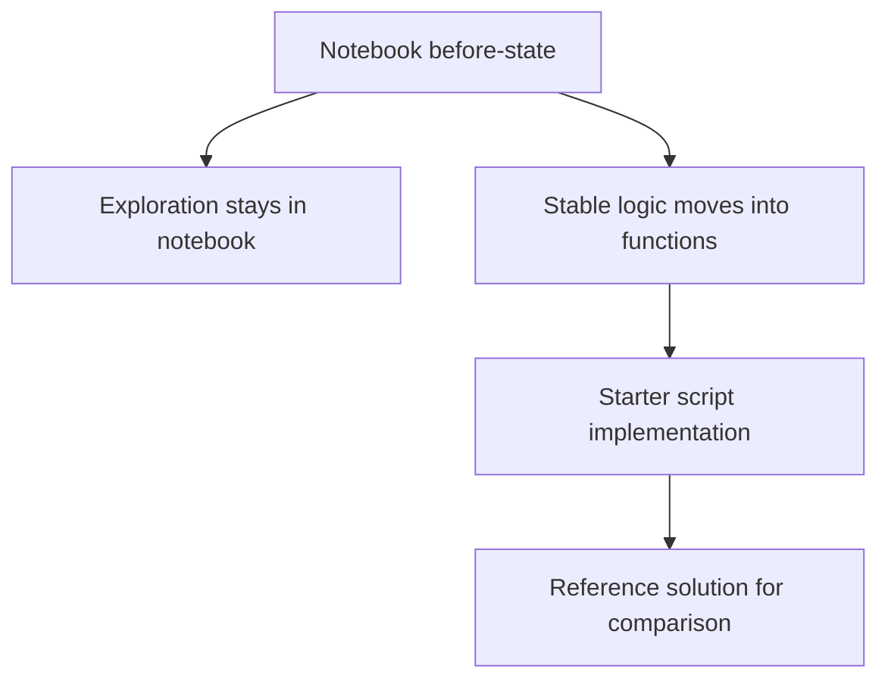

# From Jupyter Notebooks to Python Programs

This lesson is about turning a useful but notebook-shaped workflow into reusable Python code.

The original notebook, [titanic-original.ipynb](titanic-original.ipynb), is intentionally kept in a notebook-style format: it mixes quick exploration, feature engineering, and model comparison in a way that is common during early experimentation. The goal is not to copy every cell into a script. The goal is to identify the stable parts of the workflow and move those into clear functions.

## Learning Goals

By the end of this exercise, you should be able to:

- recognize which notebook cells are exploratory only,
- extract reusable preprocessing steps into a function,
- separate data loading, preprocessing, and model training responsibilities,
- run the finished workflow from a Python file without relying on notebook state.

## Why Refactor Notebook Code?

1. **Clearer structure**
   - Notebooks are great for trying ideas quickly.
   - Python modules are better once the workflow stabilizes and needs clear function boundaries.

2. **Cleaner collaboration**
   - Notebook outputs and metadata make Git diffs noisy.
   - Python files are easier to review, test, and discuss with teammates.

3. **More reliable execution**
   - Notebook state can hide dependencies between cells.
   - A script makes execution order explicit from top to bottom.

4. **Easier reuse**
   - Refactored functions can be imported into other notebooks, scripts, or tests.
   - This makes it much easier to extend the workflow later.

## Recommended Refactoring Workflow

Use this workflow while reading [titanic-original.ipynb](titanic-original.ipynb):

1. **Mark exploratory cells**
   - Keep quick EDA, plots, and one-off checks in the notebook.
   - Do not move every display or chart into the final script.

2. **Identify reusable transformations**
   - Look for stable logic such as filling missing values, encoding categorical columns, and preparing features for models.
   - These are the parts that should become functions.

3. **Refactor into clear function boundaries**
   - A good starting split for this lesson is:
     `load_data()`, `preprocess(dataframe)`, and `train_and_score_models(X, y)`.
   - Each function should have a single job and return explicit outputs.

4. **Keep the script simpler than the notebook**
   - The notebook shows the messy "before" version.
   - The Python file should be the cleaner "after" version.

5. **Validate the refactor**
   - Run the Python file end to end.
   - Confirm that it loads the local Titanic dataset and produces a readable model comparison table.

## Checkpoint

Before implementation, make sure these questions are clear:

- Which cells are only there for exploration or visualization?
- Which transformations belong in `preprocess()`?
- What should `train_and_score_models()` return so the result is easy to
  inspect?

## Common Pitfalls

- Copying the notebook cell-by-cell into a script without simplifying the flow.
- Keeping plotting code inside reusable preprocessing functions.
- Hardcoding paths that only work in one directory.
- Comparing models on notebook globals instead of passing `X` and `y` explicitly.
- Forgetting that the script version should be easier to rerun than the notebook version.

## Self-Check

Verify the following:

- the starter script is easy to understand even before implementation,
- the finished script runs from the repository root,
- function inputs and outputs are clear,
- the result table can be printed without depending on notebook state.

## Exercise

Use [titanic-original.ipynb](titanic-original.ipynb) as the notebook-style "before" workflow. Then implement the cleaner Python version in:

- Starter file: `04-refactoring-guide-and-titanic-exercise/src/titanic_refactoring/titanic_exercise.py`
- Reference solution: `04-refactoring-guide-and-titanic-exercise/src/titanic_refactoring/titanic_solution.py`

The notebook helps you see the raw workflow. The starter file is where you build the reusable version. The solution file is there as a later reference if you want to check your approach.
