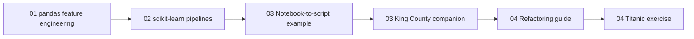

# From Jupyter Notebooks to Python Programs

This repository teaches a practical workflow for moving from exploratory notebooks to reusable Python code.

You will:

- practice feature engineering in pandas,
- move those steps into scikit-learn transformers and pipelines,
- refactor notebook logic into importable Python modules,
- and complete a guided refactoring exercise on the Titanic dataset.

## Resource Overview

| Resource | Summary |
|---|---|
| [01 - Feature engineering with pandas](01-feature-engineering-with-pandas/01-feature-engineering-with-pandas.ipynb) | Introduces feature engineering on the Seattle weather dataset using pandas, including data validation with Pydantic, cleaning messy values, standardizing categories, converting types, and handling missing data in a train/new-data-safe way. |
| [02 - Feature engineering with scikit-learn pipelines](02-feature-engineering-with-sklearn-pipelines/02-feature-engineering-with-sklearn-pipelines.ipynb) | Rebuilds the Seattle weather preprocessing flow with custom scikit-learn transformers and pipelines, focusing on `fit`/`transform` separation, reusable cleanup steps, and safer preprocessing for new data. |
| [03 - Notebook-to-script example](03-notebook-to-python-scripts/03-from-jupyter-notebook-to-python-scripts-example.ipynb) | Uses the King County housing dataset to show how exploratory notebook work becomes reusable Python code by separating one-off analysis from stable cleaning rules that should be moved into modules. |
| [03 - King County data preparation companion](03-notebook-to-python-scripts/king-county-data-preparation.ipynb) | Walks through turning the King County notebook cleaning logic into small reusable functions, including outlier filtering, basement feature rebuilding, last-change calculation, and missing-value filling. |
| [04 - Refactoring guide](04-refactoring-guide-and-titanic-exercise/04-from-jupyter-notebooks-to-python-programs.md) | Explains how to decide which parts of the Titanic notebook should stay exploratory and which parts should move into reusable Python functions such as `load_data()`, `preprocess()`, and model-evaluation helpers. |
| [04 - Titanic exercise notebook](04-refactoring-guide-and-titanic-exercise/titanic-original.ipynb) | Provides a notebook-style Titanic baseline with quick EDA, feature-engineering candidates, age imputation logic, and model comparison steps that learners then refactor into the accompanying Python exercise file. |

## Suggested Workflow

1. Work through the exercise folders in order: [01-feature-engineering-with-pandas](01-feature-engineering-with-pandas) -> [02-feature-engineering-with-sklearn-pipelines](02-feature-engineering-with-sklearn-pipelines) -> [03-notebook-to-python-scripts](03-notebook-to-python-scripts) -> [04-refactoring-guide-and-titanic-exercise](04-refactoring-guide-and-titanic-exercise/).
2. Open each notebook or guide from its exercise folder; starter files stay local to each exercise, while datasets are shared from the root [data/](data/) folder.
3. For exercise `04`, complete [04-refactoring-guide-and-titanic-exercise/src/titanic_refactoring/titanic_exercise.py](04-refactoring-guide-and-titanic-exercise/src/titanic_refactoring/titanic_exercise.py).
4. After your own attempt, you can use [04-refactoring-guide-and-titanic-exercise/src/titanic_refactoring/titanic_solution.py](04-refactoring-guide-and-titanic-exercise/src/titanic_refactoring/titanic_solution.py) as a reference.

## Mermaid Diagrams

This repository contains Mermaid diagrams. If you want them to render in VS Code, we recommend installing the `Markdown Preview Mermaid Support` extension:

- [Install in VS Code](vscode:extension/bierner.markdown-mermaid)
- [View on Marketplace](https://marketplace.visualstudio.com/items?itemName=bierner.markdown-mermaid)

This diagram mirrors the recommended learning order across the repository:



## Environment

Please make sure you **use this repository as a template** and set up a new virtual environment. You can use the following commands:

### **`macOS`**

```bash
  pyenv local 3.11.3
  python -m venv .venv
  source .venv/bin/activate
  pip install --upgrade pip
  pip install -r requirements.txt
  ```

### **`Windows`**

 For `PowerShell` CLI:

  ```PowerShell
  pyenv local 3.11.3
  python -m venv .venv
  .venv\Scripts\Activate.ps1
  python -m pip install --upgrade pip
  pip install -r requirements.txt
  ```

  For `Git-Bash` CLI:

  ```bash
  pyenv local 3.11.3
  python -m venv .venv
  source .venv/Scripts/activate
  python -m pip install --upgrade pip
  pip install -r requirements.txt
  ```

The [requirements.txt](requirements.txt) file contains all libraries and dependencies needed to execute the notebooks.

## Learning Objectives

By the end of this repository, you should be able to:

- Refactor notebook code into reusable Python functions and modules.
- Design scikit-learn-compatible custom transformers.
- Build preprocessing pipelines with fit/transform separation.
- Avoid common train/validation leakage mistakes.
